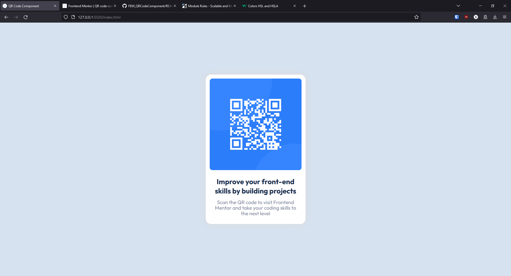

# Frontend Mentor - QR code component solution

This is a solution to the [QR code component challenge on Frontend Mentor](https://www.frontendmentor.io/challenges/qr-code-component-iux_sIO_H). Frontend Mentor challenges help you improve your coding skills by building realistic projects. 

## Table of contents

- [Overview](#overview)
  - [Screenshot](#screenshot)
  - [Links](#links)
- [My process](#my-process)
  - [Built with](#built-with)
  - [Useful Resources](#useful-resources)
- [Author](#author)
- [Acknowledgments](#acknowledgments)

## Overview

### Screenshot

### Links

- [Solution URL](https://github.com/SuperSonic57/FEM_QRCodeComponent.git)
- [Live Site URL](https://supersonic57.github.io/FEM_QRCodeComponent/)

## My process

### Built with

- Semantic HTML5 markup
- SASS variables
- Followed SMACCS standards for structuring SASS files

### Useful Resources

- [SMACCS](https://smacss.com/)

## Author

- Frontend Mentor - [@SuperSonic57](https://www.frontendmentor.io/profile/SuperSonic57)

## Acknowledgments

The SASS reset was derived from those created by Andy Bell and Kevin Powell.
